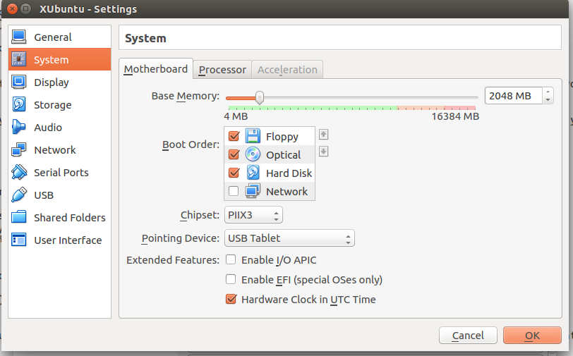
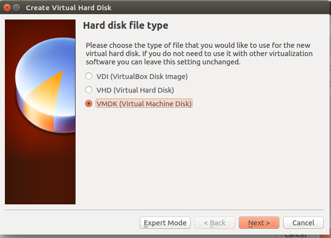
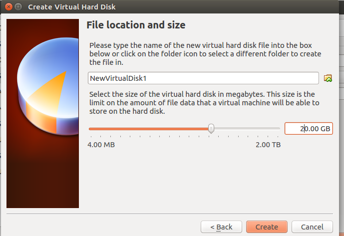
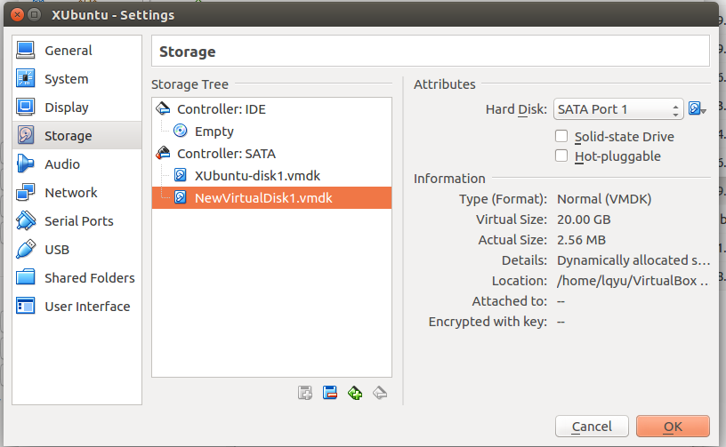
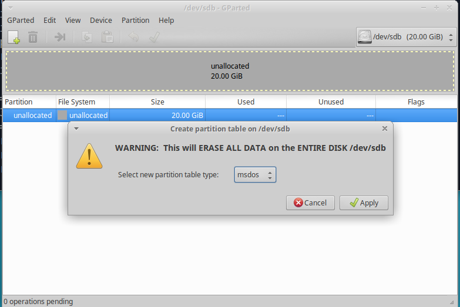
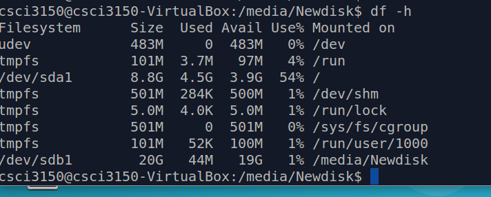

# Change the VM setting

Adding a system call need to recompile the linux kernel from source. Our VM doesn't have enough space to store the kernel source that we are going to download and the compiled files when we compiling, so let's add an extra disk into our VM first.
We also need to increase the CPU memory to sucessfully use the new kernel. 

To test our own system call is okay, we need to replace the new compiled kernel with old ones.  But some minor errors would cause the new kernel to crash. So I recommend to download another new image from course website to do the following experiments.


## Increase CPU memory 

Open the setting of our VM image. Select "System" item and change the base Memory to 2048MB.




## Add extra disk in the VirtualBox setting

1. Open the setting of our machine image. Select "Storage" item and next select "Controller:SATA" item.


2. Click right "add" button and create a disk file


3. Set the disk size to 20GB




Now, the setting looks like 



Click "OK" and continue to mount this new disk in our linux VM. 

## Partition 

The easiest and user-friendly way is probably to use `gparted` to partition the new disk.

Open the terminal and install it 
```
sudo apt-get install gparted
```

Start this tool
```
sudo gparted
```
Select `/dev/sdb` and click 'Device'-->'Create Partitio Table...'. Use default setting and click 'Apply'.




Click 'New' button and create new partition.


Apply all operations and exit. 

## Mount 
After you are done creating your partitions (most likely it will be just one ext4 data partition, since this is your additional storage drive), you need to permanently mount it.


At this step you already know what names your new partition(-s) have. If not sure, following command will remind you about existing drives and partitions on them:

```
sudo fdisk -l
```

Then create a new folder and try mounting it with 
```
sudo mkdir /media/Newdisk
sudo mount -t ext4 /dev/sdb1 /media/Newdisk
sudo chown csci3150 csci3150 /media/Newdisk
```

Then this new disk is mounted to '/media/Newdisk' and you can use `df -h` to show that. 




Note: Everytime when you reboot the system, you need to re-mount this disk again. If you want to permanently mount it. You can refer [this link](https://askubuntu.com/questions/125257/how-do-i-add-an-additional-hard-drive)


