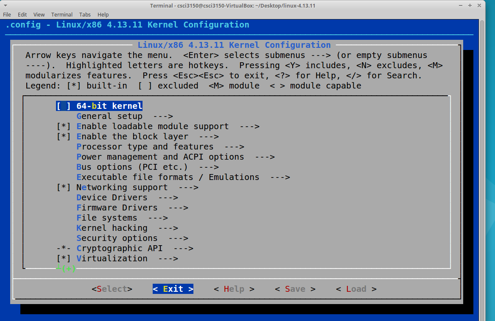

# Compile and Reboot

To integrate the system call and to be able to actually use it, we’ll need to recompile the kernel.

## Install Prerequisites
You will need to install a few packages before you can get started. Use the following commands.
```
sudo apt-get update
sudo apt-get install git fakeroot build-essential ncurses-dev xz-utils libssl-dev bc

```

## Configuring

Before compiling the kernel, we need to configure which modules are to be included and which ones are to be left out.

There are many ways to go about doing this.

An easy and straightforward way to do this is to first copy your existing kernel config file and then use `menuconfig` to make changes (if necessary). This is the fastest way to do it and probably, the safest.
```
cp /boot/config-$(uname -r) .config   
sudo make menuconfig
```
This is the part where you could end up removing support for a device driver or do something of the sort which will eventually result in a broken kernel. If you are unsure about making changes, just save and exit.



## Making 
To compile the kernel and its modules, we use the `make` command.
This is followed by using `make modules_install` to install the kernel modules.
Finally, we use `make install` to copy the kernel and the .config file to the /boot folder and to generate the system.map file (which is a symbol table used by the kernel).

These three steps put together usually take up a lot of time. Use the following command to perform the above tasks:
```
sudo make -j 1 && sudo make modules_install -j 1 && sudo make install -j 1
```
Note: We use the `-j` option to specify the number of cores to be used. This tends to speed up the process considerably. You can use `nproc` to check the number of processing units available. In the VM, it only has one core. But if you want to compile on your own computer, you maybe need to change it. 

## Final Steps
Once the kernel and its modules are compiled and installed, we want to use the new kernel the next time we boot up.
For this to happen, we need to use the following command:
```
update-initramfs -c -k 4.13.11   
```
Then, use the following command, which automatically looks for the kernels present in the /boot folder and adds them to the grub’s config file.
```
update-grub  
```
Once this is done, restart the system.

