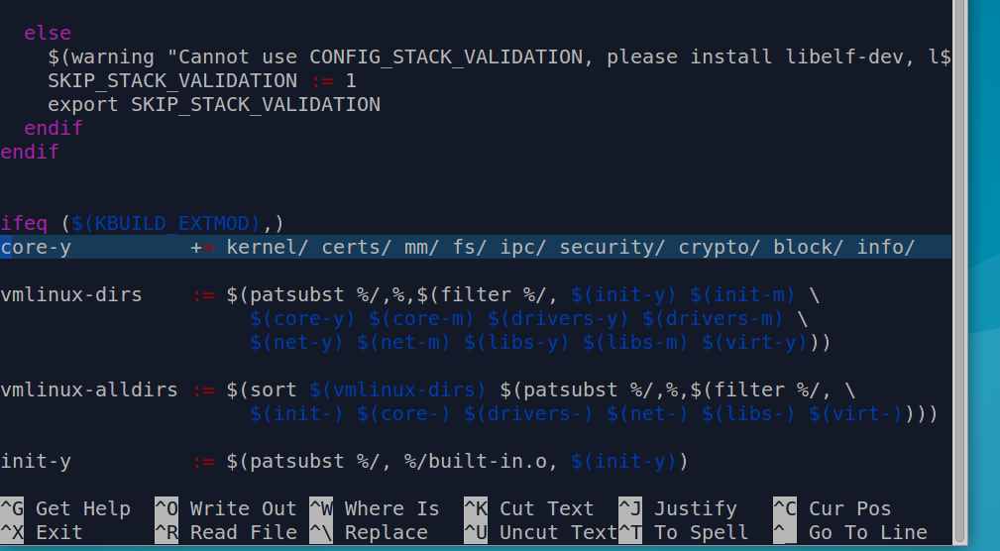

# Modifying necessary kernel files to integrate our system call

## Modify Makefile

First, we need to add the new ‘**info**’ directory to the kernel’s Makefile.

Change back into the linux-4.13.11 folder and open Makefile

Goto line number 944 which says: 

```core-y  += kernel/ certs/ mm/ fs/ ipc/ security/ crypto/ block/```

and change it to 

```core-y  += kernel/ certs/ mm/ fs/ ipc/ security/ crypto/ block/ info/```



This tells the compiler that the source files of our new system call can be found in the **info/** directory.


## Modify syscall_32.tbl

Now, we’ll have to alter the **syscall_32.tbl**.
A neat way to figure out where this file is present is to use the `find` command on the terminal from the linux-4.13.11 directory.
```
find -name syscall_32.tbl   ### Should show the file's location
```
(This is equivalent to using the find option(ctrl+F) in nautilus to look for where a specific file is located)


In kernel 4.13.11, it is present in **/arch/x86/entry/syscalls/syscall_32.tbl**.

Now, edit the file as shown to include the new system call number and its entry point. Just note the system call number for reference. (Ideally, we should be implementing a wrapper for our system call and will never be using the number directly. But, in this example, we will going to use the system call number to test the system call)

The number of the system call should be one plus the number of the last system call (it was 385 in our case). 
```
380	i386	pkey_mprotect		sys_pkey_mprotect
381	i386	pkey_alloc		sys_pkey_alloc
382	i386	pkey_free		sys_pkey_free
383	i386	statx			sys_statx
384	i386	arch_prctl		sys_arch_prctl			compat_sys_arch_prctl
##############< Make your edit here >###################

```


## Modify syscalls.h

Finally, we’ll have to alter the **syscalls.h** file. Again, use `find` look for where the syscalls.h file is present.

```
find -name syscalls.h
```
In kernel 4.13.11, it is found in **/include/linux/**.

Add the following line to the end of the file (before the #endif) as shown:
```
asmlinkage long sys_listProcessInfo(void);
```


